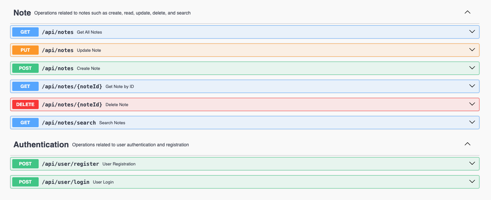

# Notezilla - Simple Note API

Notezilla is a lightweight backend REST API built with Spring Boot that allows users to register, log in, and manage their personal notes securely.

## ✨ Features

- User registration and login with JWT authentication
- Note CRUD operations (create, read, update, delete)
- Search notes by keyword (in title or content)
- Swagger UI documentation
- Domain Driven Design (DDD) architecture

## 🔧 Technologies

- Spring Boot 3.4
- Spring Security
- JSON Web Tokens (JWT)
- Spring Data JPA (Hibernate)
- MySQL
- Maven
- Swagger (springdoc-openapi)
- Lombok

## 🔐 Authorization

- All endpoints are protected by JWT-based authentication.
- Users must first register and then log in to access note operations.


## 🚀 Getting Started

> Make sure the following tools are installed on your system:

- Java 17+
- Maven 3+

### 1. Clone the repository

```bash
git clone https://github.com/yourusername/notezilla.git
cd notezilla
```

### 2. Build the project

```bash
mvn clean install
```

### 3. Run the application

```bash
mvn spring-boot:run
```

The application will be available at:  
📌 `http://localhost:8080`

Swagger UI will be available at:  
📌 `http://localhost:8080/swagger-ui.html`  
or  
📌 `http://localhost:8080/swagger-ui/index.html`

## 🛠 API Preview

